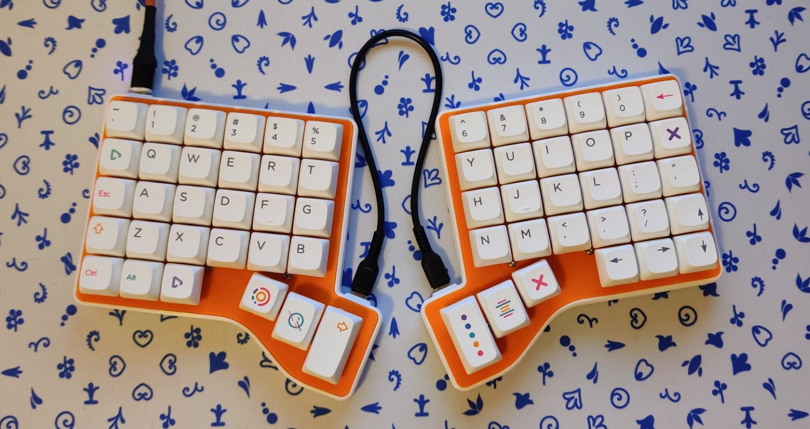
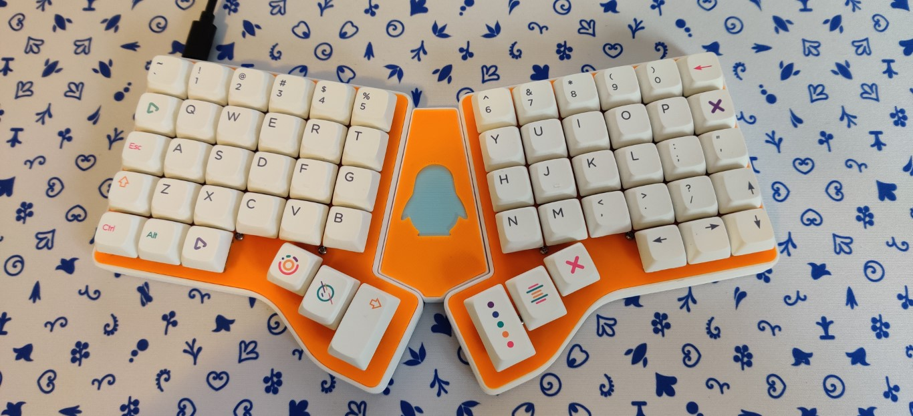
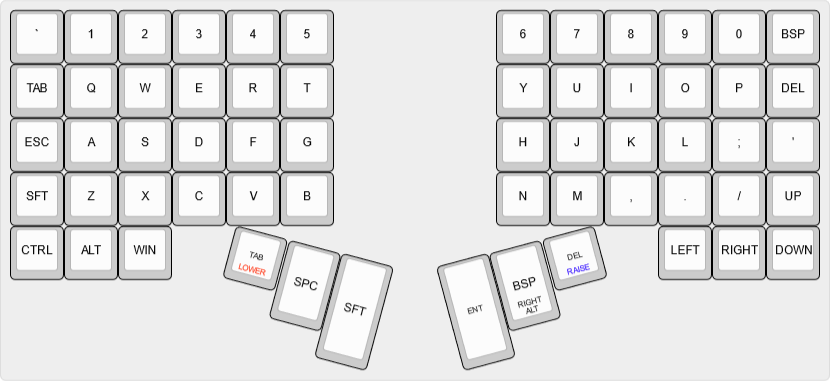
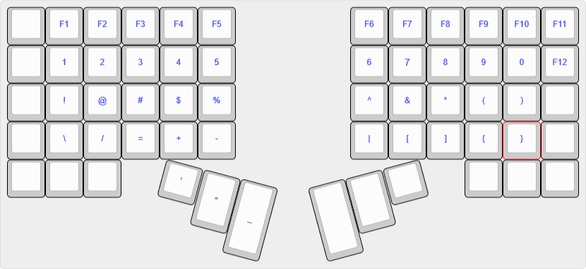
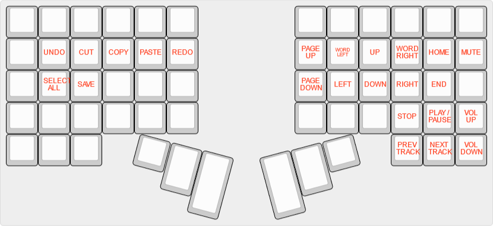

# simplyKeeb 60K family

This repository contains everything to build different variants of my 60 keys keyboard layout. The layout is designed with **10 finger typing, programmers & gamers** in mind.

The following variants are available at the moment:

- [simplyKeeb S60ph](printedmx) - *A completely 3D printed hotswap split keyboard*
- [simplyKeeb S60](splitmx) - *A pcb variant of the S60ph using a RP2040 and smd components*

|  |
|:--:|
| <b>simplyKeeb S60</b>|

|  |
|:--:|
| <b>simplyKeeb S60  with Adapter</b>|

## Layout

*Right Alt* is on a thumb key, because of german *Umlaute* like 'ä, ü & ö'. To use the *Backspace* in a repeating manner do a double tap and hold. This will trigger a repeating *backspace* instead of the hold key.

Please be aware, that the shortcuts on the keys are *Windows Shortcuts*. Many of them won't work on Linux or Mac OS.