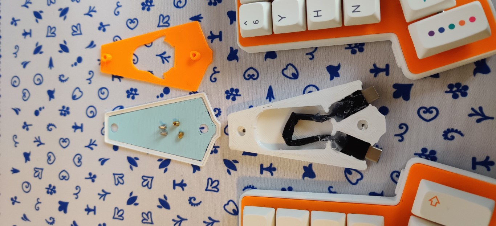

# simplyKeeb S60

This folder contains everything to build the **simplyKeeb S60**.

|  |
|:--:|
| <b>simplyKeeb S60</b>|

|  |
|:--:|
| <b>simplyKeeb S60  with Adapter</b>|

## Features

- Split 
- 60 Keys with three key thumb clusters
- On Board SMD components
- RP2040
- USB C Connectors

## BOM

- Assembled PCB (produced by JLCPCB)
- 60x Hotswap Sockets
- 14x M2x12mm screws
- 14x M2x4mm Heat Set Inserts

## Adapter

Print all the parts from the **adapter** folder. If you want to change the cut out, you are free to edit the Fusion 360 model. Besides a modified usb type c cable, two M2 heat set inserts and two M2x5mm screws are needed.

## Credits

I used some of the great footprints from the [Keyswitch Kicad Library](https://github.com/kiswitch/kiswitch) and from [ai03](https://github.com/ai03-2725/MX_Alps_Hybrid).